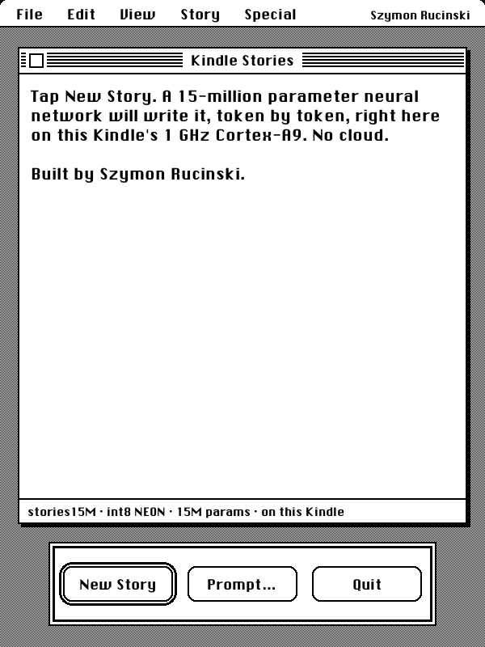
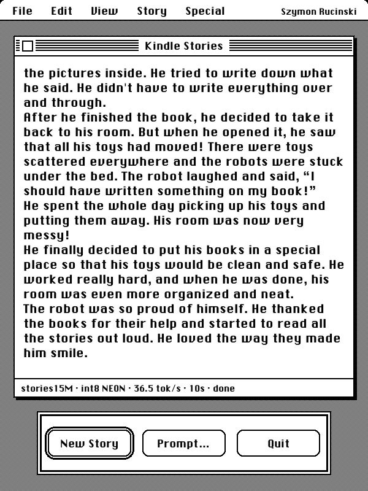
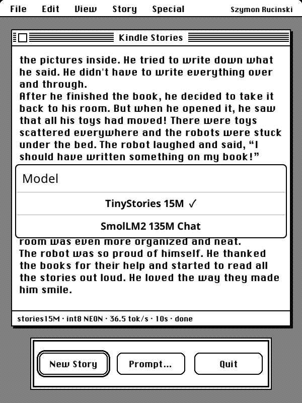
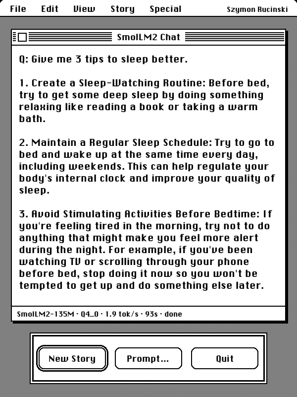

# Kindle Stories

Kindle Stories runs small language models on a Kindle Basic 2, fully offline, behind a 1-bit Macintosh
System 1 interface. It is a KOReader plugin. Tap New Story and Karpathy's TinyStories 15M writes a
story at about 40 tokens per second on the Kindle's single 1 GHz Cortex-A9. Switch to SmolLM2-135M
and it answers short questions at about 2 tokens per second. The speed comes from
hand-written ARM NEON int8 kernels that are almost 7x faster than the reference code and give
bit-identical output.

<table>
  <tr>
    <td></td>
    <td></td>
  </tr>
  <tr>
    <td></td>
    <td></td>
  </tr>
</table>

The screenshots are framebuffer dumps from the device. The story screenshot shows 36.5 tok/s instead of 40
because KOReader redraws the e-ink panel while the model runs.

## Hardware

Kindle Basic 2, jailbroken, running [KOReader](https://koreader.rocks):

- NXP i.MX6 SoloLite, one Cortex-A9 core at 1 GHz, NEON but no hardware integer divide
- 512 MB RAM
- 600x800 e-ink panel, 16 gray levels

## Benchmarks

TinyStories 15M, 256 tokens from "Once upon a time", seed 42, on the device. The runs are repeated
until other processes used under 4% of the CPU (`scripts/bench.sh`).

| Program                            | Weights | tok/s    |
| ---------------------------------- | ------- | -------- |
| `run.c` (llama2.c reference)       | fp32    | 6.25     |
| `runq.c` (llama2.c reference)      | int8    | 5.88     |
| `run-fast.c` (this repo, NEON)     | fp32    | 15.3     |
| `runq-fast.c` (this repo, NEON)    | int8    | **40.1** |

Every build uses the same compiler and flags, and the fast versions produce the same tokens as the
references. During development I hashed every logit vector to check this, and `kernels/check.sh`
compares the generated text byte for byte, both greedy and sampled.

SmolLM2-135M-Instruct through llama.cpp, with the same wrapper and one thread:

| Quantization | tok/s | Resident memory |
| ------------ | ----- | --------------- |
| Q4_0         | 2.05  | 115 MB          |
| Q8_0         | 1.66  | 167 MB          |

The plugin uses Q4_0. A short answer like the one in the screenshot takes about a minute and a half,
including loading the model.

## How it works

The plugin (`plugin/kindlestories.koplugin`) draws the whole screen itself into a KOReader blitbuffer:
the dithered gray desktop, the striped title bar, the System 1 alert box with its buttons, all in the
Chicago font. When you start a story it launches the model binary in the background, writing to
`/tmp/kindlestories.out`. Every half second it reads that file and redraws only the window with the
fast e-ink waveform. Both model programs follow the same small contract: `-n steps -i prompt` on the
command line, tokens on stdout as they are generated, and `achieved tok/s: X` on stderr at the end.
That last line is how the plugin knows the model has finished. Quitting kills the process.

TinyStories runs on `runq-fast`, my NEON port of llama2.c's `runq.c`. SmolLM2 runs on `smol`, a
75-line wrapper around llama.cpp (`smollm/smol.cpp`) that applies the chat template, samples with a low
temperature and a mild repetition penalty, and prints only the answer.

All binaries are static and cross-compiled with zig for `arm-linux-musleabihf`, so they don't depend on
any libraries on the Kindle.

### Why int8 was slower than fp32 at first

Quantizing to int8 cuts the weights from 58 MB to 17 MB, so it should have been much faster. On this
chip the reference `runq.c` was slower than fp32 (5.88 vs 6.25 tok/s), for two reasons:

- `GS`, the quantization group size, is a runtime variable, and the matmul computes
  `w->s[(in + j) / GS] * x->s[j / GS]` for every group of 32 weights. The Cortex-A9 has no divide
  instruction, so that is two calls to the `__aeabi_idiv` software routine per group, close to a
  million per token.
- The compiler does vectorize the int8 dot product, but only 4 bytes at a time: it loads 4 weights and
  4 activations, widens both to int16, and multiply-accumulates into int32. That is a lot of
  instructions per byte of weights.

### The NEON kernel

`kernels/runq-fast.c` replaces the matmul. It works on four output rows per pass, so each block of the
activation vector loaded into registers is reused four times. For each group of 16 values it multiplies
int8 pairs into int16 with `vmull_s8` and `vmlal_s8`. That cannot overflow, because two products of at
most 127² still fit in an int16. It then pairwise-adds into int32 accumulators with `vpadalq_s16`. The
group scales are applied once per group, and there are no divides left.

The gains, in the order I made them:

| Change                                                    | tok/s |
| --------------------------------------------------------- | ----- |
| Reference `runq.c`                                        | 5.9   |
| NEON 4-row int8 kernel, no software divides               | 31.3  |
| Prefetch the weights 2 KB ahead                           | 35.3  |
| Prefetch KV-cache rows, walk attention sequentially       | 36.8  |
| NEON `exp` for the 32k-logit softmax (within 2 ulp)       | 38.9  |
| Exact rounding inlined in `quantize()`                    | 40.2  |

The softmax change matters because sampling runs it over all 32,000 logits on every token. The
`quantize()` change replaces a libm `round()` call per element; it runs on the activations before every
matmul. The fp32 build (`kernels/run-fast.c`) shares the attention and softmax code from
`kernels/neon_common.h` and reaches 15.3 tok/s.

At this point the model is memory bound. Each token reads about 17 MB of weights, at about 0.98 GB/s,
and a plain streaming read on this board measures about 0.87 GB/s. More arithmetic tricks won't help
much; fewer bytes per weight would.

## Install

You need a jailbroken Kindle with KOReader and a way to copy files to it (USB, or SSH through
KOReader's SSH plugin). The binaries were built for and tested on a Kindle Basic 2. Other ARMv7 Kindles
with NEON should work, but the layout assumes a 600x800 screen.

1. Build or download the binaries and models (see [Build from source](#build-from-source)).
2. Copy these files to the Kindle's USB storage (`/mnt/us` on the device):

   ```
   koreader/plugins/kindlestories.koplugin/   the plugin folder from this repo
   koreader/fonts/ChicagoFLF.ttf
   llm/runq-fast
   llm/tokenizer.bin
   llm/stories15M_q80.bin
   llm/smollm/smol
   llm/smollm/SmolLM2-135M-Instruct-Q4_0.gguf
   ```

   Over SSH, `make deploy-all KINDLE=root@<kindle-ip>` does the same thing. Add
   `KINDLE_PASSWORD=` if the SSH server accepts an empty password.
3. Restart KOReader.

If you had an older build called `tinystories.koplugin`, delete it; `scripts/deploy.sh` does this for you.

## Usage

In KOReader open the Tools menu (the wrench icon), then More tools, then **Kindle Stories**.

- **New Story** starts a story from a random opening line, or asks SmolLM2 a random question.
- **Prompt…** lets you type your own opening or question.
- The **Story** menu lists the preset openings and questions.
- The **Special** menu switches between TinyStories 15M and SmolLM2 135M Chat. The choice is saved.
- **Quit** or the close box in the title bar stops the model and returns to KOReader.

The status strip at the bottom of the window shows progress while generating and the speed when done.

## Build from source

You need an x86_64 Linux machine with `make`, `git`, `curl`, `cmake`, `ninja` and Python 3.

```sh
make fetch    # zig 0.14.1, llama2.c, models and font, all into .work/
make build    # build/run-fast, build/runq-fast, build/exp_check, build/smol
make ref      # optional: the unmodified llama2.c programs, for comparison
```

`make fetch` produces the int8 model by running llama2.c's `export.py --version 2` on `stories15M.pt`,
which needs `pip install torch numpy`. Nothing large is committed. Models, the font, zig and the
llama.cpp checkout (pinned to commit `42916d8`) all go into `.work/`, which is ignored by git.

The kernels are compiled with

```sh
zig cc -target arm-linux-musleabihf -mcpu=cortex_a9 -O3 -ffast-math -static -include stdint.h
```

The `-include stdint.h` is there because llama2.c's `run.c` uses `int8_t` without including
`stdint.h`. glibc's headers happen to pull it in, musl's don't. `scripts/zcc` and `scripts/zcxx` wrap
zig so that CMake can use it to build llama.cpp.

To benchmark on the device after `make ref deploy-all` (with `KINDLE` set as for deploying):

```sh
scripts/bench.sh runq-fast stories15M_q80.bin
ssh root@<kindle-ip> sh /mnt/us/llm/neon/check.sh runq-ref runq-fast stories15M_q80.bin
```

For development, `make lint` runs luacheck, StyLua and clang-format in check mode, `make fmt` formats
everything, and `make test` runs the Lua unit test. CI runs all of these and cross-compiles the
binaries on every push.

```
plugin/kindlestories.koplugin/   the KOReader plugin
kernels/                         NEON versions of llama2.c's run.c and runq.c, device-side bench scripts
smollm/                          llama.cpp wrapper for SmolLM2
scripts/                         fetch, build, deploy and benchmark scripts
docs/screenshots/                framebuffer captures from the device
```

## Known issues

**KOReader can freeze at 99% CPU if the Kindle is kept awake.** If you run
`lipc-set-prop com.lab126.powerd preventScreenSaver 1` (handy during development, since otherwise the
Kindle sleeps and WiFi drops) and then leave KOReader idle, its autosuspend plugin asks powerd to
suspend when the timeout runs out (15 minutes by default), powerd refuses, and `_schedule_kindle` in
`plugins/autosuspend.koplugin/main.lua` (line 147) calls `UIManager:scheduleIn` with a negative delay.
`UIManager:_checkTasks` then spins forever and the UI stops responding. This is a KOReader bug, not
something in this plugin. Set `preventScreenSaver` back to 0 when you are done, or turn off KOReader's
autosuspend. If it already happened, restart KOReader.

## What's next

Since the int8 model is limited by memory bandwidth, the next step is fewer bits per weight. My recent
paper, [FTerViT](https://arxiv.org/abs/2605.21171) ([code](https://github.com/szymonrucinski/FTerViT)),
trains a fully ternary vision transformer. Ternary weights pack into 2 bits, a quarter of the int8
traffic, and multiplying by -1, 0 or 1 needs no multiplier at all. I'd like to try the same idea on a
small language model on this Kindle.

## Credits

- [llama2.c](https://github.com/karpathy/llama2.c) by Andrej Karpathy (MIT). `kernels/run-fast.c` and
  `kernels/runq-fast.c` are derived from its `run.c` and `runq.c`; see `kernels/LICENSE-llama2c`. The
  TinyStories 15M weights come from [karpathy/tinyllamas](https://huggingface.co/karpathy/tinyllamas).
- [llama.cpp](https://github.com/ggml-org/llama.cpp) (MIT), fetched at build time, not vendored.
- [SmolLM2](https://huggingface.co/HuggingFaceTB/SmolLM2-135M-Instruct) by Hugging Face (HuggingFaceTB),
  using the GGUF conversion by [bartowski](https://huggingface.co/bartowski/SmolLM2-135M-Instruct-GGUF).
- [KOReader](https://github.com/koreader/koreader), the e-reader software the plugin runs in.
- ChicagoFLF, the Chicago-style font the whole UI uses. `scripts/fetch.sh` downloads it from
  [after-dark-css](https://github.com/bryanbraun/after-dark-css); it is not included here.
- [zig](https://ziglang.org), used as the cross-compiler.

## Author

Szymon Rucinski ([rucinski.ai](https://rucinski.ai), [GitHub](https://github.com/szymonrucinski)).
I work on efficient machine learning, from low-bit models to making them run on small hardware. I'm open
to internships and positions in edge AI and ML systems.

## License

MIT, see [LICENSE](LICENSE). The llama2.c-derived kernels keep their original MIT notice in
`kernels/LICENSE-llama2c`.
